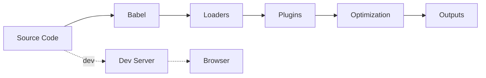

# VeroVault — Next-gen Fintech Web App

[](https://github.com/ChainsQueenEth/fintech/actions/workflows/ci.yml)

VeroVault is a modern, mobile-first fintech experience inspired by best-in-class digital banks. It blends React 18, TypeScript, Tailwind CSS, Framer Motion, and React Query into a cohesive design system and developer workflow. The stack is wired together with Webpack 5, Babel, and PostCSS for a fully configurable build pipeline.

## 📚 Table of Contents

- [✨ Highlights](#-highlights)
- [🧰 Tech Stack](#-tech-stack)
- [🗂️ Project Structure](#️-project-structure)
- [🛠️ Build System](#-build-system)
- [🚀 Getting Started](#-getting-started)
- [🔒 Environment Configuration](#-environment-configuration)
- [🧾 Available Scripts](#-available-scripts)
- [🧹 Linting](#-linting)
- [🧱 Code Style](#-code-style)
- [🧪 Testing Approach](#-testing-approach)
  - [⚙️ jest.config.ts](#️-jestconfigts)
  - [✅ Unit Tests](#-unit-tests)
- [🧭 Debugging & Observability](#-debugging--observability)
- [🤖 CI](#-ci)
- [📦 Bundle Analysis](#-bundle-analysis)
- [🎨 UI/UX Principles](#-uiux-principles)
- [🗺️ Next Steps](#️-next-steps)

## ✨ Highlights
- Responsive, adaptive UI composed with Tailwind utilities and Framer Motion
- Strong debugging ergonomics via a toggleable runtime console and structured logging helpers
- Query caching and mock data orchestration powered by React Query and browser APIs
- Robust tooling: ESLint, Prettier, Jest, Testing Library, and strict TypeScript configuration
- Webpack foundation with PostCSS + Tailwind pipeline and production-ready optimisations

## 🧰 Tech Stack
- **Languages:** TypeScript (ESNext), modern JavaScript
- **Framework:** React 18 with Suspense, React Query 5
- **Styling:** Tailwind CSS 3, utility-first with custom tokens via Tailwind config
- **Animation:** Framer Motion 11
- **Tooling:** Webpack 5, Babel 7, PostCSS, Autoprefixer, ts-jest
- **Testing:** Jest 29, @testing-library/react, user-event, jsdom
- **Quality:** ESLint (React, Testing Library, TypeScript rules) + Prettier formatting

## 🗂️ Project Structure
```
src/
  index.tsx                 # Entrypoint
  index.css                 # Global styles (Tailwind)
  App.tsx                   # App shell + ErrorBoundary + Suspense
  AppProviders.tsx          # React Query + Debug providers
  components/               # UI building blocks and motion-enhanced sections
    AppErrorBoundary.tsx
    AppLayout.tsx
    DebugConsole.tsx
    Header.tsx
    Footer.tsx
    HeroSection.tsx
    FeatureHighlights.tsx
    MotionCardDeck.tsx
    InsightsSection.tsx
    PricingSection.tsx
    LoadingScreen.tsx
    __tests__/              # Component unit tests
  design-system/
    motion/
      motion-presets.ts     # Shared motion utilities
  services/
    api-client.ts           # Fetch wrapper + Zod parsing
    insightsService.ts      # Mock insights (API when configured)
  utils/
    debug.tsx               # Debug context and logging
    test-utils.tsx          # Custom RTL render with providers
  views/
    HomeView.tsx            # Home composition
  setupTests.ts             # JSDOM polyfills (e.g., IntersectionObserver)
```

## 🛠️ Build System

The build pipeline transpiles modern TypeScript/JSX, processes CSS (Tailwind + PostCSS), injects environment variables, and outputs optimized bundles with code-splitting.



Notes
- `views/HomeView.tsx` lazy-loads heavy sections to reduce the initial bundle.
- `webpack.config.js` extracts vendor libraries for better caching via `splitChunks` and uses `runtimeChunk: 'single'`.
- Webpack orchestrates Loaders, Plugins, Optimization, Dev Server, and Outputs. Babel runs inside Webpack via `babel-loader` to transpile TS/JSX to JS.
- Babel presets: `preset-env`, `preset-react`, `preset-typescript`.
- Loaders: `babel-loader`, `postcss-loader` (Tailwind, Autoprefixer).
- Plugins: `HtmlWebpackPlugin`, `MiniCssExtractPlugin` (production), `dotenv` + `DefinePlugin` for `API_BASE_URL`, optional `BundleAnalyzer`.
- Outputs: hashed assets in `static/js` and `static/css` plus `index.html`.

## 🚀 Getting Started

- Install dependencies (requires Node 20+ and pnpm):

```bash
pnpm install
```

- Start the dev server:

```bash
pnpm dev
```

The app will start with mock data by default.

## 🔒 Environment Configuration

- Create a `.env` file (see `.env.example`) to set `API_BASE_URL` used by the frontend. When `API_BASE_URL` is not set, the app will fall back to local mock data for insights.
- The dev server port can be customized with `PORT`.

The value of `API_BASE_URL` is injected at build time via Webpack's `DefinePlugin` and `dotenv-webpack`.

## 🧾 Available Scripts
| Command            | Description |
| ------------------ | ----------- |
| `pnpm dev`         | Start the Webpack dev server with HMR at `http://localhost:3000` |
| `pnpm build`       | Create an optimised production build in `dist/` |
| `pnpm lint`        | Run ESLint across `.ts`/`.tsx` source files |
| `pnpm test`        | Execute the Jest test suite once |
| `pnpm test:watch`  | Watch mode for the Jest suite |
| `pnpm typecheck`   | Verify TypeScript types without emitting output |
| `pnpm analyze`     | Build with bundle analyzer to inspect bundle size |

## 🧹 Linting

ESLint enforces code quality, consistency, and accessibility rules across the codebase.

- Run lints: `pnpm lint`
- Auto-fix minor issues: `pnpm lint -- --fix`

Linting runs in CI to keep contributions consistent and catch issues early.

Rules are configured in `eslint.config.js` (flat config). Notable plugins include:

- `eslint-plugin-react`, `eslint-plugin-react-hooks`
- `@typescript-eslint/*`
- `eslint-plugin-testing-library`, `eslint-plugin-jest-dom`
- `eslint-plugin-jsx-a11y` for accessibility best practices

## 🧱 Code Style

Adopt a consistent, scalable style to keep the codebase maintainable.

- **Formatting**
  - Use your editor’s formatter; ESLint is configured to be Prettier-compatible via `eslint-config-prettier`.
  - Prefer 2-space indentation; trailing commas and semicolons are acceptable per formatter defaults.

- **Naming conventions**
  - Filenames: `kebab-case` (e.g., `feature-highlights.tsx`).
  - React components: `PascalCase` exported from their files (e.g., `FeatureHighlights`).
  - Variables/functions: `camelCase`; constants that are truly global can use `UPPER_SNAKE_CASE`.
  - Tests live beside features under `src/components/__tests__/` using `*.test.tsx`.

- **Modularity & structure**
  - Keep files focused; avoid files >500 LOC by splitting into helpers/modules.
  - UI components are presentational; keep business logic in `core/` or `services/`-like modules.
  - Prefer dependency-free utilities in `utils/` and reusable motion/visual primitives in `design-system/`.

- **Imports**
  - Use path alias `@/*` for intra-src imports, or relative when clearer.
  - Group imports: stdlib → external → internal modules.

- **Commits**
  - Prefer Conventional Commits (e.g., `feat:`, `fix:`, `chore:`, `test:`) for readable history.

## 🧪 Testing Approach
- **Jest + Testing Library:** Component-driven assertions and accessible queries
- **Custom render helper:** `src/utils/test-utils.tsx` wraps with React Query providers (no theme provider needed)
- **Sample coverage:** Hero CTA rendering and DebugConsole state toggling to guard key flows
- **Configuration:** jsdom environment, CSS modules mocked, coverage collection ready for CI

### ⚙️ jest.config.ts

Jest is configured in `jest.config.ts`:

- `preset: 'ts-jest'` to run TypeScript tests without a separate build
- `testEnvironment: 'jsdom'` to simulate the browser for React components
- `moduleNameMapper` for path alias `@/*` and to mock CSS with `identity-obj-proxy`
- `setupFilesAfterEnv` loads `src/setupTests.ts` (e.g., JSDOM polyfills)
- `collectCoverageFrom` and `coverageDirectory` enable coverage in CI
- `reporters`: default plus `jest-junit` writing `junit/junit.xml` (uploaded by CI as an artifact)

## ✅ Unit Tests

Component test files are located in `src/components/__tests__/`:

- `src/components/__tests__/AppLayout.test.tsx`
- `src/components/__tests__/DebugConsole.test.tsx`
- `src/components/__tests__/FeatureHighlights.test.tsx`
- `src/components/__tests__/Footer.test.tsx`
- `src/components/__tests__/Header.test.tsx`
- `src/components/__tests__/HeroSection.test.tsx`
- `src/components/__tests__/InsightsSection.test.tsx`
- `src/components/__tests__/MotionCardDeck.test.tsx`
- `src/components/__tests__/PricingSection.test.tsx`

Run all tests:

```bash
pnpm test
```

## 🧭 Debugging & Observability
- `DebugProvider` persists state via `localStorage` and `URLSearchParams` for quick toggling
- Runtime console surfaces locale, timezone, connection, memory, and session uptime data
- Calls to `useDebug().log` emit styled console messages gated by debug mode
- DOM receives `data-debug` attribute when active, allowing CSS-based layout tracing

## 🤖 CI

GitHub Actions workflow is provided at `.github/workflows/ci.yml` to run lint, typecheck, tests, and build on pushes and PRs to `main`/`master`. Push builds can inject `API_BASE_URL` via encrypted secrets.

## 📦 Bundle Analysis

Run `pnpm analyze` to build the app with `webpack-bundle-analyzer` enabled and inspect the output bundle composition.

## 🎨 UI/UX Principles
- Mobile-first layout with fluid typography (`clamp`) and stacked sections
- Accessible colour contrast, focusable controls, and semantic markup
- Motion used sparingly with Framer Motion, respecting reduced motion preferences
- Tailwind utilities with custom tokens (configured in `tailwind.config.js`); no styled-components

## 🗺️ Next Steps
1. Connect to real financial APIs (banking aggregates, FX rates, insights)
2. Expand authentication + onboarding surfaces
3. Layer in visual regression snapshots (e.g., Storybook with Chromatic)
4. Automate CI pipeline (lint, test, typecheck) with GitHub Actions

---
Crafted to showcase a modern fintech experience and a maintainable front-end foundation.
